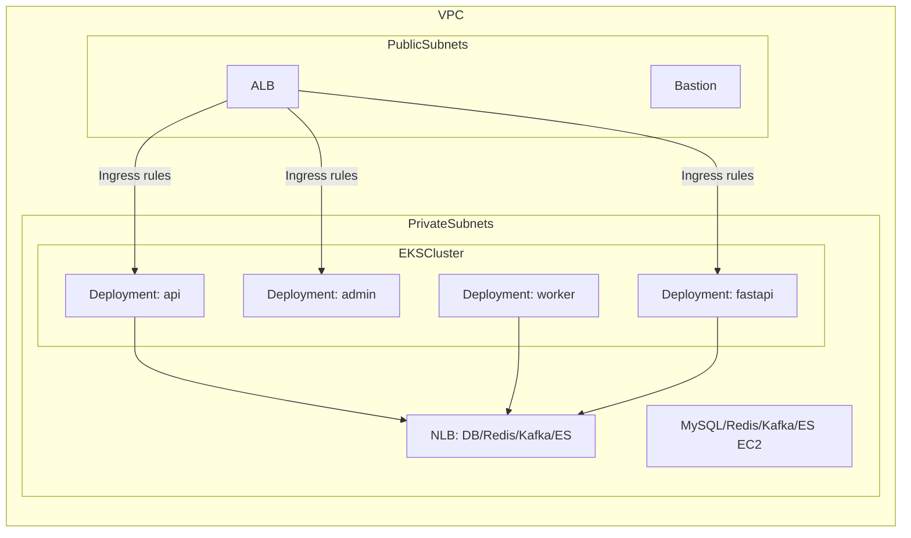

## 1. 개요 및 목표

- **목표**: 이 프로젝트에서 정의한 VPC/보안그룹/데이터 계층 구조를 기반으로, 애플리케이션 계층(`api-module`, `worker-module`, `admin-module`, `fastapi-module`)을 **EKS 위 Kubernetes Pod(Deployment)** 로 전환하는 설계를 정의한다.
- **범위**:
  - **애플리케이션 계층만** EKS로 전환한다. (DB, Redis, Kafka, Elasticsearch 등 데이터 계층은 EC2 + docker compose 구조를 그대로 유지한다고 가정)
  - 기존 VPC, Subnet, NAT, VPC Endpoint, 보안그룹, 데이터 계층, 로드밸런서 구성은 **참고용 설계 기준**일 뿐, 이 레포 안에서 VPC/보안그룹/ALB/NLB 등을 직접 생성하는 것을 기본으로 한다.

---

## 2. 현재 인프라 요약 (기존 설계 기준)

- **네트워크(`modules/network`)**:
  - 단일 VPC(`aws_vpc.main`)와 2개 AZ에 분산된 **퍼블릭/프라이빗 서브넷 쌍**을 사용한다.
  - **퍼블릭 서브넷**: 애플리케이션용 ALB, Bastion, (현재) 애플리케이션 ASG 인스턴스 배치.
  - **프라이빗 서브넷**: MySQL/Redis/Kafka/Elasticsearch EC2 인스턴스 및 이를 앞단에서 노출하는 NLB 배치.
  - NAT Gateway + 프라이빗 라우팅을 통해 프라이빗 서브넷에서 인터넷(ECR, 외부 API, SSM 등) 접근을 제공한다.

- **보안 그룹(`modules/security`)**:
  - **`alb_sg`**: 80/443 포트에 대해 인터넷 전체(0.0.0.0/0) 인바운드를 허용. Ingress ALB(AWS LB Controller)에서 사용.
  - **`db_sg`**:
    - `eks_node_sg`에서 오는 MySQL(3306)/Redis(6379)/Kafka(9092)/Elasticsearch(9200) 트래픽 허용.
    - VPC CIDR 기반 MySQL 복제 및 NLB 헬스체크용 포트 허용.
  - **`bastion_sg`** 및 bastion → app/db SG 간 SSH/전체 TCP 트래픽 허용 규칙.

- **로드밸런서**:
  - **퍼블릭 ALB**: Kubernetes Ingress + AWS Load Balancer Controller가 생성. 경로 기반 라우팅(`/`→api, `/admin*`→admin, `/fastapi*`→fastapi).
  - **프라이빗 NLB(`db_nlb`, `modules/lb`)**:
    - MySQL, Redis, Kafka, Elasticsearch 각각에 대한 TCP target group 구성.
    - 백엔드는 프라이빗 서브넷의 EC2 인스턴스(데이터 계층).

- **애플리케이션 계층(`modules/compute-app`)**:
  - 4개 Launch Template(api, worker, admin, fastapi) + ASG 조합으로 EC2 인스턴스를 관리.
  - 각 인스턴스의 user-data에서 ECR로부터 이미지를 pull 후 docker 컨테이너를 실행.
  - `api_min_size`/`api_max_size` 등 `*_min_size`, `*_max_size`, `on_demand_*` 변수로 스케일링 범위를 정의.

- **데이터/백엔드 계층(`modules/compute-db`, `modules/compute-data`)**:
  - MySQL master/slave EC2 + docker compose로 DB 클러스터 구성.
  - Redis/Kafka/Elasticsearch EC2 + docker compose로 데이터/메시징 계층 구성.
  - `db_nlb`의 target group attachment를 통해 내부에서 접근 가능하며, `db_sg`를 통해 보호된다.

---

## 3. 타깃 EKS 아키텍처 설계

### 3.1 클러스터 및 노드 그룹 설계

- **EKS 클러스터 배치**:
  - `modules/network`에서 정의한 **기존 VPC 및 서브넷**을 그대로 재사용한다.
  - 컨트롤 플레인은 EKS 관리형이며, 운영 시에는 **퍼블릭 엔드포인트를 사용하되 사무실/VPN 등 제한된 IP/보안그룹만 허용**하는 방식을 기본으로 한다.

- **노드 그룹 설계**:
  - **system node group**:
    - EKS Managed Node Group으로 유지. KubeProxy, CNI, CoreDNS, AWS Load Balancer Controller, **Karpenter** 등 시스템/인프라 컴포넌트용 소규모 고정 노드.
  - **app 워크로드용 노드**:
    - **Karpenter**가 Pending 상태의 Pod를 보고 필요 시점에만 EC2 노드를 생성·삭제하여 `api`, `worker`, `admin`, `fastapi` Pod를 수용한다. 별도 Managed Node Group 대신 Karpenter 기반 동적 프로비저닝을 사용한다.
  - 모든 노드(system + Karpenter로 생성된 노드)는 **프라이빗 서브넷에만** 배치하여, 애플리케이션 Pod는 외부에 직접 노출되지 않도록 한다.

- **보안 그룹 매핑**:
  - EKS 노드 그룹에는 **신규 보안 그룹 `eks-node-sg`를 생성하여 할당**한다.
  - `db_sg` 등 백엔드용 보안 그룹의 인바운드 허용 대상에 `eks-node-sg`를 추가함으로써, 현재 `db_sg`의 인바운드 규칙(MySQL/Redis/Kafka/ES from app layer)을 그대로 활용하면서 EC2 → Pod로 컴퓨팅 계층만 교체할 수 있다.

### 3.2 네트워크 및 서비스 접근

- **Pod → 데이터 계층 접근**:
  - Pod는 EKS 노드의 ENI를 통해 VPC에 붙으므로, 기존과 동일하게 `db_nlb`를 통해 MySQL/Redis/Kafka/Elasticsearch에 접근한다.
  - 애플리케이션 설정(DB URL, Redis 호스트, Kafka bootstrap servers 등)은 **기존 NLB DNS/내부 호스트네임**을 그대로 사용하도록 설계한다.

- **아웃바운드 인터넷**:
  - 기존 NAT Gateway를 그대로 사용하여, 프라이빗 서브넷의 EKS 노드가 ECR, 패키지 레지스트리, 외부 API 등에 접근한다.

- **SSM/Parameter Store 접근**:
  - 프라이빗 서브넷의 Pod/노드는 NAT Gateway를 통해 SSM API에 접근한다.
  - Pod는 **IRSA(IAM Roles for Service Accounts)** 로 부여된 IAM Role을 사용하여 SSM/Secrets Manager API를 호출한다.

### 3.3 네임스페이스 및 워크로드 구조

- **네임스페이스 설계**:
  - **애플리케이션 네임스페이스**: **`consultation-prod`** 하나만 사용한다. 운영(prod) 전용이며, **api, worker, admin, fastapi 4개 모듈을 모두 이 네임스페이스에 배치**한다. (스테이징/개발 환경 추가 시에는 `consultation-stg`, `consultation-dev` 등을 동일 방식으로 추가할 수 있다.)
  - **시스템/인프라 컴포넌트**: AWS Load Balancer Controller, Karpenter, CoreDNS 등은 **`kube-system`**에 두고, 모니터링/로깅 등 공용 컴포넌트는 `kube-system` 또는 필요 시 별도 **`infra`** 네임스페이스에 배치한다.

- **워크로드 구조**:
  - 각 모듈은 `Deployment` + `Service`로 정의하고, HTTP 엔드포인트를 갖는 모듈(api, admin, fastapi)은 `Ingress`를 통해 외부로 노출한다.



### 3.4 Karpenter 설계

- **역할**: HPA가 Pod 수를 늘리면 스케줄될 노드가 부족해질 수 있다. Karpenter는 **Pending Pod**를 감지해 필요한 만큼 노드를 프로비저닝하고, 유휴 노드는 정리하여 비용을 줄인다.
- **설치**: Helm으로 Karpenter 컨트롤러를 클러스터에 배치하고, Karpenter 전용 IAM Role(IRSA) 및 EC2/Launch Template 등 권한을 부여한다.
- **리소스 정의**:
  - **NodePool**: 스케줄링 제약(예: taint/toleration), 만료/축소 정책, weight 등. app 워크로드용 NodePool을 두고, 필요 시 api/worker/admin/fastapi별로 분리 가능.
  - **EC2NodeClass**: 노드가 생성될 **서브넷·보안 그룹**을 태그 기반 선택자로 지정한다.
    - `subnetSelector`: 프라이빗 서브넷 태그(기존 VPC의 private subnet 태그).
    - `securityGroupSelector`: **`eks-node-sg`** 태그.
  - 이렇게 하면 Karpenter가 만든 노드도 현재 설계(프라이빗 서브넷 + `eks-node-sg`, `db_sg`에서 해당 SG 허용)와 동일한 네트워크/보안 정책을 따른다.
- **용량 전략**: NodePool에서는 **on-demand 전용**(`karpenter.sh/capacity-type: on-demand`)으로 노드를 프로비저닝한다. Spot 인스턴스는 사용하지 않으며, instance family 제한은 필요 시 NodePool에 설정한다.

- **오버프로비저닝 방지 (disruption 정책)**: NodePool 설정 시 **disruption 정책**을 명시적으로 둔다. 사용량이 적은 시간대에 불필요한 노드를 정리(consolidation/expiration)하고, 필요하면 특정 시간대에 인스턴스 패밀리(예: t4g)만 사용하도록 NodePool `requirements`나 별도 NodePool로 제한을 걸어두면 비용 통제가 수월하다. Karpenter의 `disruption.expireAfter` 또는 consolidation 관련 설정을 활용한다.

- **노드 인스턴스 타입 (검토 결과)**  
  아래는 `consultation-service`(api/worker/admin), `consultation-ai`(fastapi) 코드·의존성 기준으로 정리한 권장 사항이다.
  - **api-module**: Spring Boot 3.5, Java 17. Web + JPA + Redis + Kafka + Security + OAuth2 + JWT + Swagger. JVM heap 명시 없음(컨테이너 메모리 기반).  
  - **worker-module**: Spring Boot 3.5, Java 17. Web + JPA + Kafka + Swagger. Kafka 컨슈머 부하.  
  - **admin-module**: Spring Boot 3.5, Java 17. Web + JPA + Redis + Swagger + core-module.  
  - **fastapi-module** (consultation-ai): Python 3.12, FastAPI. Kafka 컨슈머(동일 프로세스) + MySQL + ES + Redis + LangChain/OpenAI(원격 API). LLM 추론은 외부 호출이므로 노드 메모리 부담은 상대적으로 작음.  
  - **권장 인스턴스**: 기존 Terraform `app_instance_type`(t4g.small)과 동일한 **Graviton(t4g)** 계열 유지. NodePool의 `instanceType` 또는 `requirements`에 다음을 허용하는 것을 권장한다.  
    - **t4g.small** (2 vCPU, 2 GiB): Pod 1~2개(각 512Mi~1Gi request) 수용. 최소 용량용.  
    - **t4g.medium** (2 vCPU, 4 GiB): Pod 2~4개 수용. 기본 권장(비용·밀도 균형).  
    - 필요 시 **t4g.large** (4 vCPU, 8 GiB)를 추가해 노드당 Pod 밀도 확대 가능.  
  - Pod당 요청 리소스(Deployment request)는 **메모리 512Mi~1Gi, CPU 250m~500m** 수준을 가이드로 두고, 모듈별 트래픽에 따라 조정한다. 이 범위면 t4g.small/medium 노드에서 여러 Pod를 안정적으로 빈 패킹할 수 있다.

### 3.5 로깅 및 모니터링 (CloudWatch Container Insights)

- **배경**: 기존 EC2 환경에서는 로그를 직접 수집하거나 CloudWatch Agent를 노드에 설치해 사용했을 수 있다. EKS에서는 **CloudWatch Container Insights**를 활성화하는 것을 권장한다.
- **설정 요약**:
  - 노드 그룹(Managed Node Group, Karpenter로 생성된 노드)에 **CloudWatch 메트릭 전송 권한**을 부여한다. (노드 IAM Role에 `CloudWatchAgentServerPolicy` 또는 동등한 정책 연결.)
  - EKS 클러스터에는 `aws-cloudwatch-metrics` Helm 차트(aws eks-charts)를 사용해 **CloudWatch Agent DaemonSet(메트릭 전용)** 을 배포한다. 이 구성은 Pod/노드 CPU·메모리 등의 메트릭만 CloudWatch Metrics 로 전송하며, 애플리케이션 stdout/stderr 로그는 CloudWatch Logs 로 수집하지 않는다(비용 절감을 위해).
- **효과**: Pod·노드 단위 메트릭을 CloudWatch 콘솔에서 한눈에 확인할 수 있어, EC2 시절 대비 운영 난이도를 낮출 수 있다. 필요 시 알람(Alarms)과 대시보드를 추가해 활용한다. 애플리케이션 로그 수집이 추가로 필요할 때는 Fluent Bit(`aws-for-fluent-bit`) 등을 별도 차트로 도입할 수 있다.

### 3.6 상세 아키텍처 다이어그램 (Mermaid)

```mermaid
flowchart TD
  internet((Internet))

  %% VPC 및 서브넷
  subgraph VPC["VPC (10.0.0.0/16)"]
    subgraph PublicSubnets["Public Subnets"]
      igw[Internet Gateway]
      nat[NAT Gateway]
      alb[ALB\nIngress]
      bastion[Bastion EC2]
    end

    subgraph PrivateSubnets["Private Subnets"]
      %% EKS 클러스터
      subgraph EKS["EKS Cluster\nconsultation-eks"]
        subgraph SystemNodes["System Node Group\nManaged Node Group"]
          sysNodes[(system nodes)]
        end
        subgraph KarpNodes["Karpenter Nodes\non-demand t4g.small/medium"]
          karpNodes[(app nodes)]
        end

        subgraph KubeSystem["Namespace: kube-system"]
          coredns[(CoreDNS)]
          albctl[AWS Load Balancer\nController]
          karpctrl[Karpenter Controller]
          cwMetrics[CloudWatch Metrics\nDaemonSet]
        end

        subgraph AppNs["Namespace: consultation-prod"]
          apiDep[(Deployment: api)]
          adminDep[(Deployment: admin)]
          fastapiDep[(Deployment: fastapi)]
          workerDep[(Deployment: worker)]
        end
      end

      %% 데이터 계층 (EC2 + docker compose)
      subgraph DataLayer["DB / Cache / MQ / Search (EC2)"]
        db[MySQL\n(primary/replica)]
        redis[Redis]
        kafka[Kafka]
        es[Elasticsearch]
      end

      dbNlb[NLB\nmysql/redis/kafka/es]
    end

  end

  %% 인터넷 ↔ 퍼블릭 서브넷
  internet --> igw
  igw --> alb
  igw --> nat
  internet --> bastion

  %% NAT (인터넷/SSM/ECR 등)
  nat --> sysNodes
  nat --> karpNodes

  %% ALB ↔ 애플리케이션 Ingress
  alb -->|"Ingress: /"| apiDep
  alb -->|"Ingress: /admin*"| adminDep
  alb -->|"Ingress: /fastapi*"| fastapiDep

  %% 애플리케이션 ↔ 데이터 계층 (NLB)
  apiDep -->|"DB/Cache/MQ/Search"| dbNlb
  fastapiDep --> dbNlb
  workerDep --> dbNlb

  dbNlb --> db
  dbNlb --> redis
  dbNlb --> kafka
  dbNlb --> es

  %% 노드/보안그룹 관계 (개념적)
  classDef sg fill:#ffffff,stroke:#888,stroke-dasharray:3 3,color:#333;
```

---

## 4. 애플리케이션(Pod) 설계

### 4.1 공통 패턴

- **컨테이너 이미지**:
  - ECR 레지스트리 및 리포지토리는 기존과 동일하게 사용한다.
    - `consultation-service/api`
    - `consultation-service/worker`
    - `consultation-service/admin`
    - `consultation-service/fastapi`
  - 이미지 태그(`api_image_tag`, `worker_image_tag`, `admin_image_tag`, `fastapi_image_tag`)는 Helm values 또는 Kustomize overlay로 관리한다.

- **리소스 및 오토스케일링 매핑**:
  - 기존 ASG에서 사용하던 `*_min_size`, `*_max_size` 값을 HPA 설정에 매핑한다.
    - `Deployment.spec.replicas`(초기값) ≈ `*_min_size`
    - `HorizontalPodAutoscaler.minReplicas` = `*_min_size`
    - `HorizontalPodAutoscaler.maxReplicas` = `*_max_size`
  - **Pod 리소스**: 3.4 노드 인스턴스 타입 검토에 따라, 각 모듈 Pod의 `resources.requests`는 **memory: 512Mi~1Gi, cpu: 250m~500m** 수준을 권장한다. `limits`는 동일 또는 여유 있게 설정해 노드 빈 패킹과 Karpenter 스케일링에 활용한다.
  - **HPA**는 Pod 레플리카 수를 조절하고, **Karpenter**는 Pending Pod가 생기면 필요한 노드를 프로비저닝하고 유휴 노드를 정리한다. 둘을 함께 사용해 서비스 단위 스케일과 노드 단위 스케일을 분리한다.
  - HPA 스케일 트리거는 CPU/메모리 사용량 또는 애플리케이션 지표(Prometheus metrics)를 기준으로 한다.

- **Config/Secret 주입**:
  - 애플리케이션 설정은 ConfigMap/Secret으로 분리한다.
    - DB URL, Redis 호스트, Kafka bootstrap servers, 외부 API endpoint 등.
  - SSM Parameter Store / Secrets Manager에 저장된 민감 정보는 다음 중 한 방식으로 주입한다.
    - IRSA 권한을 가진 Pod가 **애플리케이션 코드에서 직접 SSM/Secrets Manager 호출**.
    - IRSA 권한을 가진 **initContainer/sidecar** 가 기동 시 환경 변수/파일로 주입.

### 4.2 모듈별 설계

- **api-module**:
  - **리소스 구성**: `Deployment` + `Service(ClusterIP)` + `Ingress`.
  - **포트**: 컨테이너 포트 8081.
  - **HPA**: `api_min_size`/`api_max_size`를 기준으로 min/max 설정.

- **admin-module**:
  - **리소스 구성**: `Deployment` + `Service(ClusterIP)` + `Ingress`.
  - **포트**: 8082.
  - **Ingress 라우팅**: `/admin*` 경로 전용 rule로 분리.
  - **HPA**: `admin_min_size`/`admin_max_size`를 기준으로 min/max 설정.

- **fastapi-module**:
  - **리소스 구성**: `Deployment` + `Service(ClusterIP)` + `Ingress`.
  - **포트**: 8000.
  - **Ingress 라우팅**: `/fastapi*` 경로 전용 rule.
  - **HPA**: `fastapi_min_size`/`fastapi_max_size`를 기준으로 min/max 설정.

- **worker-module**:
  - **리소스 구성**: `Deployment` + `Service(ClusterIP)` (내부 통신/헬스체크용, 필요 시).
  - 외부 HTTP Ingress는 필요 없고, Queue/Kafka/DB와 내부 통신만 수행한다.
  - HPA는 큐 적체량, 컨슈머 레이턴시 등 메시지 처리 메트릭 기반으로 확장할 수 있다.

### 4.3 배포 안정성 (Readiness/Liveness Probes)

- **배경**: 기존 ASG의 Health Check는 인스턴스 전체를 대상으로 했지만, EKS에서는 **Pod 단위** 헬스체크가 중요하다. `livenessProbe`와 `readinessProbe`를 Deployment에 반드시 설정하지 않으면 롤링 배포·스케일 아웃 시 트래픽이 준비되지 않은 Pod로 가거나, 장애 Pod를 조기에 제거하지 못해 서비스 중단이 발생할 수 있다.
- **헬스 엔드포인트**:
  - **api-module, admin-module** (Spring Boot): 애플리케이션에서 **`/actuator/health`** 를 명확히 노출하고, Deployment의 probe에서 **`httpGet.path: /actuator/health`** 로 설정한다. (Actuator 의존성 및 `management.endpoints.web.exposure.include` 등 설정 확인.)
  - **fastapi-module**: 코드에 구현된 헬스 경로(예: `/fastapi/health`)를 사용해 동일하게 `livenessProbe`, `readinessProbe`를 설정한다.
- **Deployment 설정**: api, admin, fastapi 각 Deployment에 **`livenessProbe`** 와 **`readinessProbe`** 를 반드시 정의한다. 초기 지연(`initialDelaySeconds`), 주기(`periodSeconds`), 실패 임계(`failureThreshold`)는 앱 기동 시간과 트래픽 특성에 맞게 조정한다.

---

## 5. Ingress 및 외부 노출 설계

- **AWS Load Balancer Controller 사용**:
  - EKS 클러스터에 AWS Load Balancer Controller를 설치하여, `Ingress` 리소스 생성 시 ALB를 자동 프로비저닝한다.
  - ALB는 퍼블릭 서브넷에 배치하며, target type은 **`ip`** (Pod 직접 대상)를 권장한다.

- **Ingress 리소스 설계**:
  - **기본 전략으로 단일 ALB + 다중 path rule**로 기존 HTTP 라우팅을 재현한다.
    - `/` → `Service: api`
    - `/admin*` → `Service: admin`
    - `/fastapi*` → `Service: fastapi`
  - 필요 시 도메인 기반 라우팅(host 기반)도 추가할 수 있다.
    - 예: `api.example.com` → api 서비스, `admin.example.com` → admin 서비스.

- **보안 그룹 연결**:
  - ALB에는 기존 `alb_sg`와 동일한 규칙을 가진 SG를 사용하거나, 그대로 재사용한다.
  - ALB → EKS 노드(Pod) 트래픽은 **EKS 노드용 `eks-node-sg`**에서 인바운드 허용되도록 구성한다(타겟 타입 `ip` 사용 시 Pod가 올라간 노드의 보안 그룹이 `eks-node-sg`).

---

## 6. IAM 및 IRSA 설계

- **IRSA 기본 원칙**:
  - 각 서비스 어카운트(예: `api-sa`, `worker-sa`, `admin-sa`, `fastapi-sa`) 별로 **별도의 IAM Role**을 부여한다.
  - SSM Parameter Store, Secrets Manager, CloudWatch Logs, S3 등 외부 AWS 리소스 접근 권한은 **최소 권한 원칙**에 따라 분리한다.

- **애플리케이션별 IAM Role 예시**:
  - `api-sa`:
    - SSM Parameter Store read-only (`/config/consultation-service/*` 등).
    - CloudWatch Logs/metrics 전송 권한.
  - `worker-sa`:
    - 위와 동일한 기본 권한 + 메시지 큐/SNS/SQS/Kafka(Managed Kafka 사용 시) 관련 권한.
  - `admin-sa`, `fastapi-sa`:
    - 각 서비스가 실제로 사용하는 리소스 범위만 허용.

---

## 7. 마이그레이션 전략(고레벨)

- **1단계: EKS 인프라 준비**
  - 기존 VPC/Subnet/보안그룹 구성을 기준으로 EKS 클러스터와 system용 Managed Node Group을 생성한다.
  - AWS Load Balancer Controller, **Karpenter**(Helm + IRSA + NodePool/EC2NodeClass), 모니터링 스택(Prometheus/Grafana, CloudWatch Container Insights 등)을 설치한다.

- **2단계: 애플리케이션 매니페스트/Helm Chart 작성**
  - api, worker, admin, fastapi에 대한 Deployment/Service/Ingress/HPA/ConfigMap/Secret 리소스를 정의한다.
  - 이미지 태그, 리소스 request/limit, 환경 변수는 환경별 values 또는 Kustomize overlay로 분리한다.

- **3단계: 검증 및 점진적 트래픽 전환**
  - 스테이징/테스트 네임스페이스에서 동일 구성으로 검증한 뒤, 운영 환경에서 EKS용 ALB를 띄우고 내부·제한된 대상으로 기능·성능 테스트를 수행한다.
  - DNS 또는 상위 라우팅에서 트래픽을 기존 EC2 ALB → EKS Ingress ALB로 점진 전환한다.

- **4단계: 기존 인프라 정리**
  - EKS에서 서비스가 안정적으로 운영되는 것이 확인되면, 기존 EC2 ASG 및 관련 Launch Template·ALB 리소스를 단계적으로 정리한다. `db_nlb` 및 데이터 계층(EC2)은 유지하며 정리 순서를 조정한다.

---

## 8. README 구조 요약

이 문서는 다음 내용을 다룬다.

- **1. 개요 및 목표**: EKS 전환 배경과 범위(애플리케이션 계층 한정).
- **2. 현재 인프라 요약**: VPC, 보안그룹, 데이터 계층, ALB/NLB 구조 간략 요약.
- **3. 타깃 EKS 아키텍처**: 클러스터/노드 그룹(Managed + Karpenter)/네임스페이스/네트워크/보안 설계 + Karpenter 설계 + 로깅·모니터링(CloudWatch Container Insights) + mermaid 다이어그램.
- **4. 애플리케이션 Pod 설계**: 4개 모듈별 Deployment/Service/Ingress/HPA/Config/Secret 전략 및 배포 안정성(Readiness/Liveness Probes, `/actuator/health`).
- **5. Ingress 및 외부 노출 설계**: 단일 ALB + path 기반 라우팅, AWS Load Balancer Controller, 보안 그룹.
- **6. IAM 및 IRSA 설계**: 서비스 어카운트별 IAM Role 설계.
- **7. 마이그레이션 전략**: 단계별 전환 순서(인프라 준비 → 애플리케이션 배포 → 트래픽 전환 → 기존 ASG/ALB 정리).

